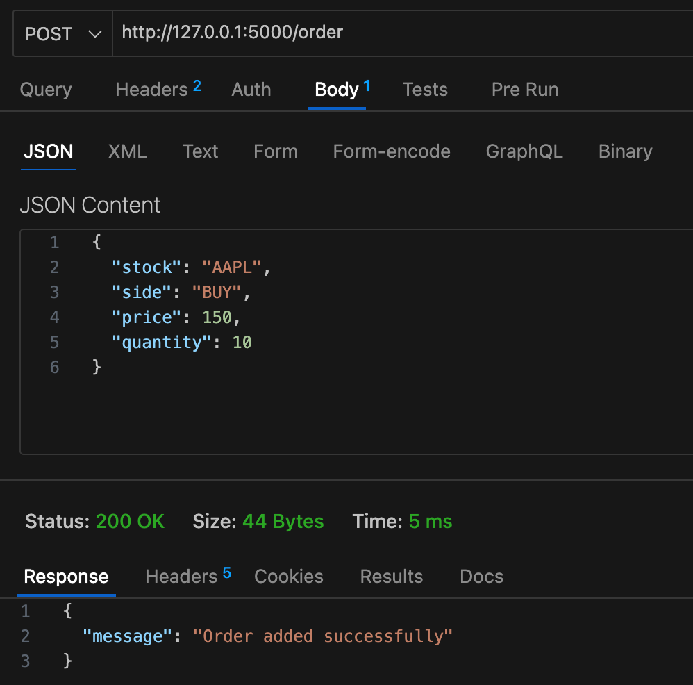
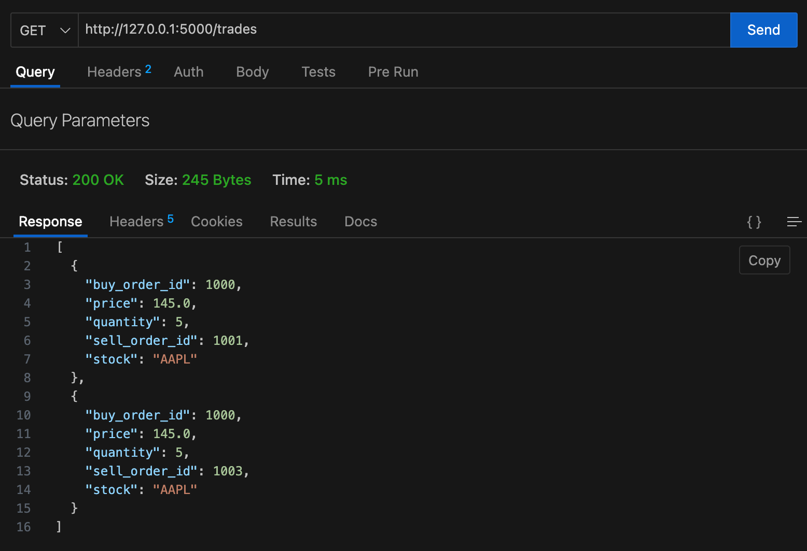

# 📈 Order Matching Engine (HFT Simulation)

## Overview
Built a high-performance order matching engine simulating stock exchange behavior using price-time priority.

## Features
- Multi-stock support (AAPL, GOOG, MSFT)
- Price-Time Priority Matching
- Thread-safe execution
- CSV-based bulk order input
- Trade logging system

## Tech Stack
- Python
- Heap (Priority Queue)
- Pandas
- Logging

## How it Works
- Orders are inserted into buy/sell heaps
- Matching occurs when buy price >= sell price
- Trades executed using FIFO within same price

## 🚀 REST API

### Run API
```bash
python api.py
```

---

### 📌 Endpoints

#### ➤ Add Order
**POST /order**

Body:
```json
{
  "stock": "AAPL",
  "side": "BUY",
  "price": 150,
  "quantity": 10
}
```

## 📸 Screenshots

### ➤ Add Order API



### ➤ Trades Output




---

#### ➤ Get Trades
**GET /trades**

Returns all executed trades.
